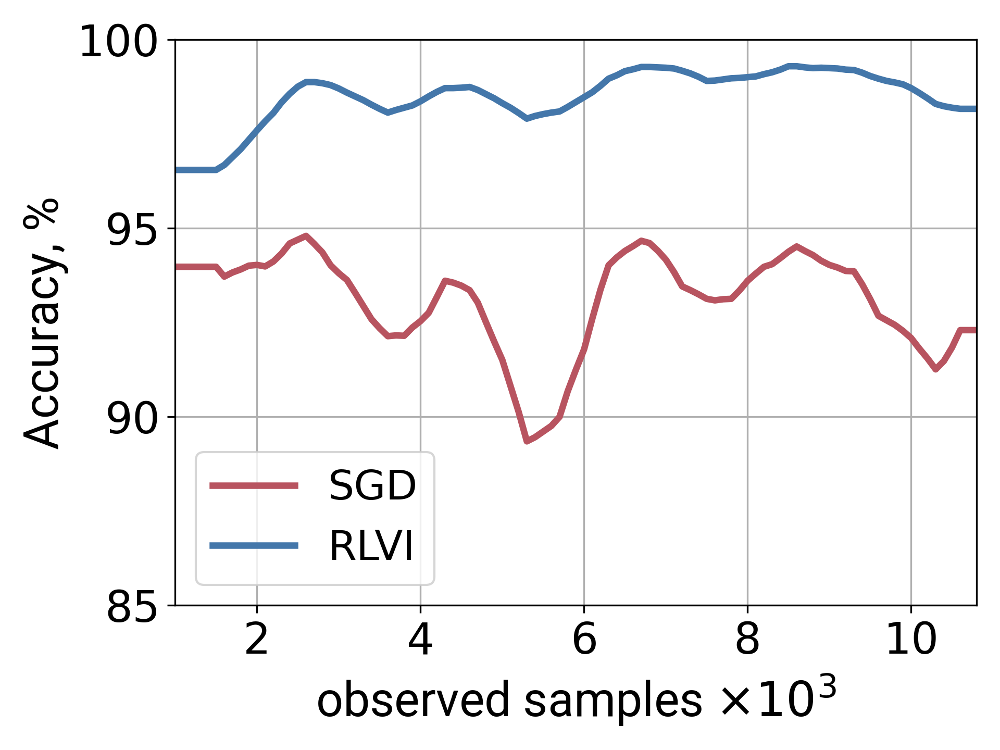
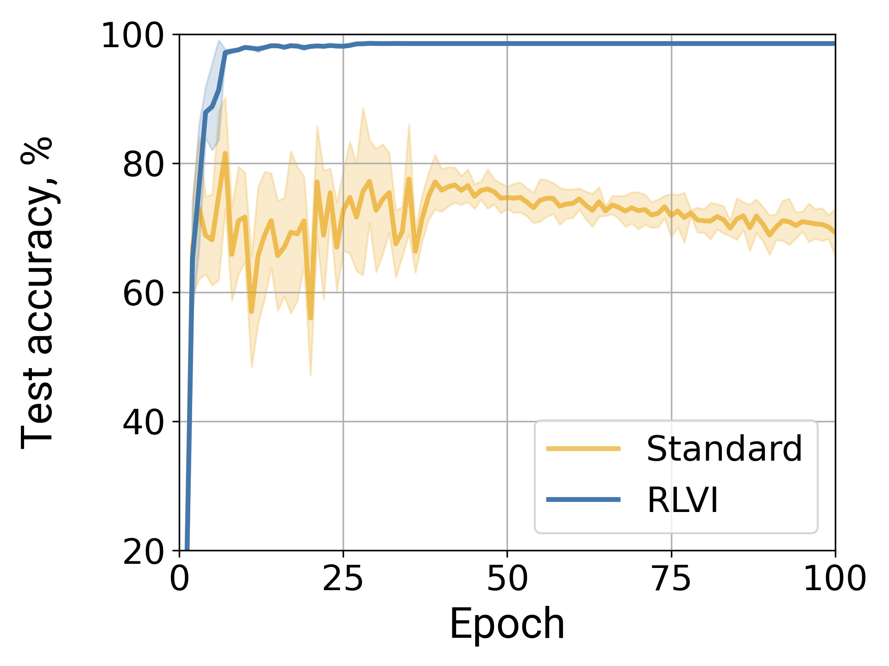

# RLVI: Robust Learning via Variational Inference

Implementation of [Adaptive Robust Learning using Latent Bernoulli Variables](https://arxiv.org/pdf/2312.00585).

Our method, called RLVI, enables robust maximization of the likelihood. The learned parametric model is thus accurate even when the training data is corrupted. Additionally, RLVI is well-suited for online or stochastic optimization as it does not require estimating the total ratio of contaminated data and adaptively infers the probabilities of sample corruption.

Please cite our paper if you find this approach useful in your work
```bibtex
@inproceedings{karakulev2024adaptive,
  title={Adaptive robust learning using latent Bernoulli variables},
  author={Karakulev, Aleksandr and Zachariah, Dave and Singh, Prashant},
  booktitle={Proceedings of the 41st International Conference on Machine Learning},
  pages={23105--23122},
  year={2024}
}
```


## Standard parameter estimation
Benchmark, reproduced from [(Osama et al., 2020)](https://doi.org/10.1109/OJSP.2020.3039632), that compares robust learning algorithms on the four test problems with corrupted samples in the training data: linear and logistic regression, principal component analysis, covariance estimation.
```
cd standard-learning
python3 main.py
```

## Online learning
Binary classification for Human Activity Recognition dataset [(Amine El Helou, 2023)](https://www.mathworks.com/matlabcentral/fileexchange/54138-sensor-har-recognition-app), performed in batches with varying level of corruption to simulate the online learning setting.
```
cd online-learning
python3 main.py
```

Accuracy levels are higher with RLVI than with stochastic likelihood maximization (SGD).
<p align="center">
    
</p>

## Deep learning
### Synthetic noise (MNIST, CIFAR10, CIFAR100)
Experiments with the datasets in which training data is corrupted with synthetic noise.
There are four types of noise: `symmetric`, `asymmetric`, `pairflip`, and `instance`. Noise rate from 0 to 1 needs to be specified to corrupt the training set.
For the method, one can use `rlvi` or one of the following: `regular`, `coteaching` [(Han et al., 2018)](https://papers.nips.cc/paper_files/paper/2018/hash/a19744e268754fb0148b017647355b7b-Abstract.html), `jocor` [(Wei et al., 2020)](https://openaccess.thecvf.com/content_CVPR_2020/papers/Wei_Combating_Noisy_Labels_by_Agreement_A_Joint_Training_Method_with_CVPR_2020_paper.pdf), `cdr` [(Xia et al., 2020)](https://openreview.net/forum?id=Eql5b1_hTE4), `usdnl` [(Xu et al., 2023)](https://doi.org/10.1609/aaai.v37i9.26264), and `bare` [(Patel & Sastry, 2023)](https://openaccess.thecvf.com/content/WACV2023/papers/Patel_Adaptive_Sample_Selection_for_Robust_Learning_Under_Label_Noise_WACV_2023_paper.pdf).

Example:
```
cd deep-learning
python3 main.py \
        --method=rlvi \
        --dataset=mnist \
        --noise_type=pairflip \
        --noise_rate=0.45
```

<p align="center">
    
</p>

### Real noise (Food101)
Experiments with the dataset in which training data is corrupted by nature: some of the training images are mislabeled and contain some noise.
For the method, one can specify `rlvi` or one of the following: `regular`, `coteaching`, `jocor`, `cdr`, `usdnl`, `bare`.

Example:
```
cd deep-learning
python3 food.py --method=rlvi
```
